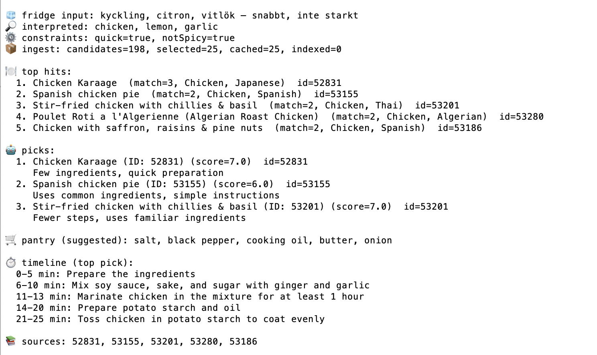

# mealdb-rag-ktor 🍳🔎🤖

**What’s in my fridge? → recipe + plan. Kotlin AI lab (Ktor + Ollama + Elasticsearch).**

A Kotlin lab project that mixes **RAG-style retrieval** with a **local LLM** to turn “what’s in my fridge?” into a realistic dinner plan.

You type something like:

> `chicken, lemon, garlic — quick, not spicy`

…and the system:

1. Uses an LLM to interpret your input into **ingredients + constraints**
2. Pulls candidate recipes from **TheMealDB**
3. Caches recipe details into **Elasticsearch** (using `idMeal` as the document id)
4. Searches & ranks recipes by **ingredient overlap** (simple but effective retrieval)
5. Uses the LLM again to generate:

   - **shopping list / pantry suggestions**
   - a **cooking timeline** for the top pick

This is intentionally a **small, educational lab**: local-first AI, minimal dependencies, and a workflow you can run end-to-end.

---

## Demo output

> Example request: `chicken, lemon, garlic — quick, not spicy`



---

## AI + “RAG” in this project (quick explanation)

This lab uses the model **twice**:

- **AI step 1: interpretation** – convert messy human input into structured JSON (**ingredients + constraints**)
- **AI step 2: planning** – turn the top recipe into a **shopping list + cooking timeline**

In between, it does retrieval the classic way:

- Pull candidate recipes
- Index documents in Elasticsearch
- Retrieve & rank recipes by **ingredient overlap**

So it’s a compact but complete loop of:

**LLM → retrieval/indexing → LLM**

---

## Tech stack

- Kotlin + Gradle
- Ktor (REST API server)
- Kotlin CLI client
- Kotlinx Serialization
- Elasticsearch + Kibana
- Ollama (local model runtime)
- TheMealDB API

---

## Architecture

**CLI (or curl)** → **Ktor server**

Server integrates with:

- **Ollama**: interpret input + generate plan
- **TheMealDB**: recipe candidates + details
- **Elasticsearch**: cache + search index
- **Kibana**: inspect indexed docs

---

## Prerequisites

- Docker + Docker Compose
- Java 21 (or compatible)
- Gradle wrapper included (`./gradlew`)

---

## Quickstart (recommended)

> ✅ If you follow this top-to-bottom, you should be able to set up the demo and see results.

### 0) Environment configuration (`.env`)

This repo includes a **`.env` file in the project root** with a working default setup.

If you want to customize anything, edit `.env` and restart the server.

Common values:

```bash
# Server
ES_URL=http://localhost:9200
OLLAMA_URL=http://localhost:11434
OLLAMA_MODEL=qwen2.5:1.5b

# Client
MEALDB_SERVER_URL=http://localhost:8080
MEALDB_MAX=12
```

---

### 1) Start infrastructure (Docker) (Docker)

From project root:

```bash
docker compose -f docker/docker-compose.yml up -d
```

Services:

- Elasticsearch: [http://localhost:9200](http://localhost:9200)
- Kibana: [http://localhost:5601](http://localhost:5601)
- Ollama: [http://localhost:11434](http://localhost:11434)

Check containers:

```bash
docker compose -f docker/docker-compose.yml ps
```

---

### 2) Load the LLM model (curl)

This lab uses a small model by default:

- `qwen2.5:1.5b`

#### 2.1 Check Ollama is running

```bash
curl -s http://localhost:11434/api/version | jq
```

#### 2.2 Pull the model (curl)

```bash
curl -s http://localhost:11434/api/pull \
  -H "Content-Type: application/json" \
  -d '{"name":"qwen2.5:1.5b"}' | jq
```

#### 2.3 Verify the model exists

```bash
curl -s http://localhost:11434/api/tags | jq '.models[].name'
```

> Tip: model downloads can take time the first run.

---

### 3) Create the Elasticsearch index

Create the index using the included script:

```bash
./scripts/es-crate-index.sh
```

(Optional) Reset (delete + recreate):

```bash
./scripts/es-reset.sh
```

Check:

```bash
./scripts/es-mapping.sh
```

---

### 4) Start the server

Recommended (script):

```bash
./scripts/run-server.sh
```

Alternative (Gradle):

```bash
./gradlew :server:run
```

Health check:

```bash
curl -s http://localhost:8080/api/health | jq
```

---

### 5) Run the CLI client

Recommended (script):

```bash
./scripts/run-client.sh "chicken, lemon, garlic — quick, not spicy"
```

Limit number of candidates (recommended for demos):

```bash
./scripts/run-client.sh "chicken, lemon, garlic — quick, not spicy" --max 12
```

Alternative (Gradle):

```bash
./gradlew :cli:run --args="chicken, lemon, garlic — quick, not spicy"
```

---

## Running in VS Code

This repo includes a **`.vscode/` configuration** for running the server from Visual Studio Code.

Suggested workflow:

1. Open the repo folder in VS Code

   ```bash
   code .
   ```

2. Ensure Java/Gradle support is installed (e.g. _Extension Pack for Java_)

3. Use the provided VS Code run/debug configuration to start the server (look for a configuration like **Run Server**)

4. Verify:

   ```bash
   curl -s http://localhost:8080/api/health | jq
   ```

> The VS Code config is useful when stepping through request handling, prompt building, or Elasticsearch ingest.

---

## API usage (curl)

### Interpret input (AI step 1)

```bash
curl -s -X POST http://localhost:8080/api/fridge/interpret \
  -H "Content-Type: application/json" \
  -d '{"input":"chicken, lemon, garlic — quick, not spicy"}' | jq
```

### Full run (interpret + ingest + search + plan)

```bash
curl -s -X POST http://localhost:8080/api/fridge/run \
  -H "Content-Type: application/json" \
  -d '{"input":"chicken, lemon, garlic — quick, not spicy", "max": 12}' | jq
```

Notes:

- Elasticsearch is used as a cache.
- Re-running the same request becomes faster because recipes are already indexed.

---

## Kibana (inspect indexed recipes)

Open Kibana:

- [http://localhost:5601](http://localhost:5601)

Query (Kibana → Dev Tools):

```http
GET meals-lab/_search?size=1
```

---

## Scripts

This repo includes helper scripts for a consistent workflow:

- `scripts/run-server.sh` – starts the Ktor server
- `scripts/run-client.sh` – runs the CLI client
- `scripts/es-crate-index.sh` – creates the Elasticsearch index
- `scripts/es-reset.sh` – deletes + recreates the index
- `scripts/es-mapping.sh` – optional mapping tools (if applicable)

> Tip: Prefer scripts over manual commands when possible.

---

## Troubleshooting (quick hits)

### Ollama model not found

Re-run the pull:

```bash
curl -s http://localhost:11434/api/pull \
  -H "Content-Type: application/json" \
  -d '{"name":"qwen2.5:1.5b"}' | jq
```

### Elasticsearch/Kibana not ready yet

Kibana can take a minute on first start. Check logs:

```bash
docker compose -f docker/docker-compose.yml logs -f
```

### Index missing

Recreate:

```bash
./scripts/es-crate-index.sh
```

---

## Performance notes

Plan generation speed depends on:

- model size
- prompt/context length
- CPU load

Recommendations:

- Use `qwen2.5:1.5b` for fast local iteration
- Keep `max` low (8–12)
- Avoid indexing too many candidates per run

---

## Project structure

```text
mealdb-rag-ktor/
  server/                         # Ktor REST API
  cli/                            # Kotlin CLI client
  infra/
    elasticsearch/
      meals-lab-index.json        # index mapping/settings
  scripts/                        # helper scripts
  docker/
    docker-compose.yml            # Elasticsearch + Kibana + Ollama
  .vscode/                        # VS Code run/debug config
  .env                            # configuration (not committed)
  docs/
    images/
      cli-demo.png                # screenshot used in README
  README.md
```

---

## Credits

- Recipe dataset/API: TheMealDB

  - [https://www.themealdb.com/api.php](https://www.themealdb.com/api.php)

---

## License

See [LICENSE](LICENSE).
